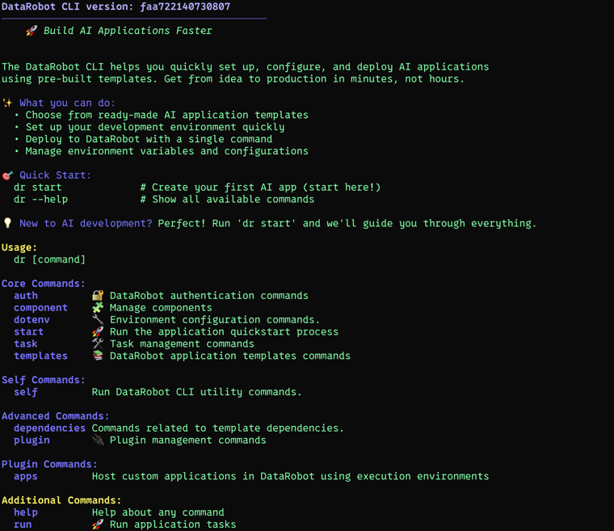

# CLI



The DataRobot CLI (`dr`) is the primary interface for App Framework users. It is a standalone binary installable on macOS, Linux, and Windows.

## Install

=== "macOS / Linux"
    ```bash
    curl https://cli.datarobot.com/install | sh
    ```

=== "Windows (PowerShell)"
    ```powershell
    irm https://cli.datarobot.com/winstall | iex
    ```

**Developer docs:** [cli.datarobot.com/dev-docs](https://cli.datarobot.com/dev-docs)

## Why it exists

The CLI solves two core problems:

1. **Onboarding friction** — Getting credentials, configuring environments, and starting App development used to require multiple stops across multiple websites and manual file editing. The CLI makes this a single guided experience.

2. **Monorepo complexity** — Full App Template solutions involve multiple languages, task managers, and configuration systems. The CLI provides a unified interface with tab completion across all of them.

## Core commands

| Command | What it does |
|---------|--------------|
| `dr auth set-url` | Configure your DataRobot endpoint. |
| `dr dotenv setup` | Interactive environment setup wizard. |
| `dr component add NAME` | Add a component to your recipe. |
| `dr run dev` | Start local development server with hot reload. |
| `dr task deploy` | Deploy all infrastructure to DataRobot. |
| `dr task infra:info` | Show deployed resource IDs and URLs. |
| `dr task infra:down` | Tear down deployed infrastructure. |

The CLI reads from `.datarobot/COMPONENT.yml` configuration files to know what environment variables are needed and how to prompt for them.
