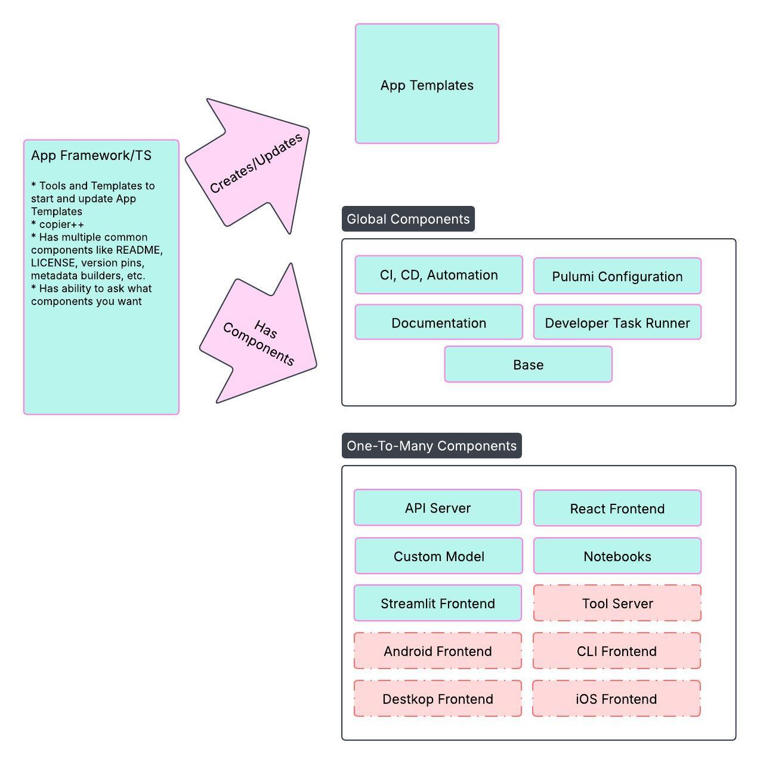
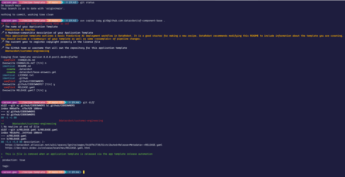

# Component model

The App Framework Template Studio is the templating and update management layer. It solves two core problems:

1. **Maintenance at scale** — A bug fix to five foundation application templates with 100 applications per template means the fix needs to reach 500 cloned applications. Manual propagation does not scale.
2. **Template creation speed** — There is value in standing up the latest AI blueprint on DataRobot quickly. You need good building blocks.

Components are `copier`-style templates. Each is a top-level folder or file set that you can add to your recipe. The answers you give during template application are recorded in `.datarobot/` as YAML, enabling future automated updates at the component-instance level.

## Global components

These appear once per application template:

| Component | Repository | Description |
|-----------|------------|-------------|
| **Base** | [af-component-base](https://github.com/datarobot-community/af-component-base) | Pulumi project, task runner, `.datarobot/` configuration, CI/CD scaffolding, `LICENSE`, `CODEOWNERS`. |
| **LLM** | [af-component-llm](https://github.com/datarobot-community/af-component-llm) | LLM Gateway or external model integration via the DataRobot LLM Deployment. |

## One-to-many components

These can be applied multiple times as you build out the template:

| Component | Repository | Description |
|-----------|------------|-------------|
| **FastAPI Backend** | [af-component-fastapi-backend](https://github.com/datarobot-community/af-component-fastapi-backend) | Local development tasks, FastAPI API documentation, and Pulumi configuration for Custom Application deployment. |
| **React Frontend** | [af-component-react](https://github.com/datarobot-community/af-component-react) | Development server, API proxy, static asset build, and prebuilt tests. |
| **Agent** | [af-component-agent](https://github.com/datarobot-community/af-component-agent) | CrewAI, LangGraph, LlamaIndex, or YAML-based NeMo Agent Toolkit. |
| **DataRobot MCP** | [af-component-datarobot-mcp](https://github.com/datarobot-community/af-component-datarobot-mcp) | FastMCP server with DataRobot predictive tools and third-party integrations. |

## Update model

The Studio uses a Dependabot-like approach: automated pull requests to all application template repositories that use the component answers, with one pull request per component. Application template authors can selectively or completely disable updates at the component-instance level.

This is powered by **Diffington** — an agent built using the App Framework itself — that monitors your recipe for component updates and creates pull requests when updates are available. To set it up, request that your repository be added to the Diffington watch list in the `#applications` channel in DataRobot's public Slack.
