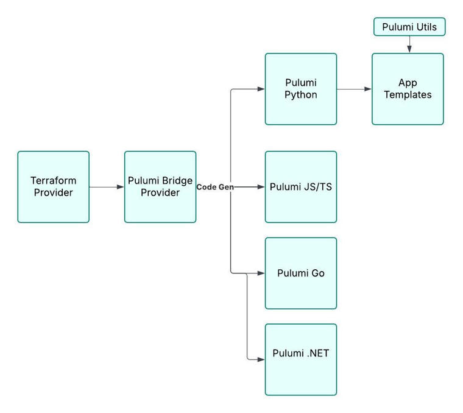

# Declarative API

The backbone of the App Framework is the Declarative API. Full applications require multiple DataRobot resources — use cases, deployed models, playgrounds, codespaces, and more. Rather than creating each manually, the App Framework manages them all as infrastructure-as-code.

## Providers

The Declarative API is available via:

- **Terraform**&mdash;[Terraform Registry](https://registry.terraform.io/providers/datarobot-community/datarobot).
- **Pulumi Python**&mdash;[`pulumi-datarobot`](https://github.com/datarobot-community/pulumi-datarobot).
- **Pulumi JS/TS**&mdash;[`@datarobot/pulumi-datarobot`](https://www.npmjs.com/package/@datarobot/pulumi-datarobot).
- **Pulumi Go**&mdash;[`github.com/datarobot-community/pulumi-datarobot/sdk`](https://github.com/datarobot-community/pulumi-datarobot).
- **Pulumi .NET**&mdash;available via the same bridge.

## How the App Framework uses it

The App Framework uses the **Python provider** and reduces boilerplate via an installable utility module:

- [pulumi-datarobot](https://github.com/datarobot-community/pulumi-datarobot)&mdash;the Pulumi provider.
- [datarobot-pulumi-utils](https://github.com/datarobot-oss/datarobot-pulumi-utils)&mdash;App Framework extension with `CustomResources` and helpers.

Each component adds its own `infra/infra/COMPONENT.py` file that declares the DataRobot resources it needs. The base Pulumi project (`Pulumi.yaml` from `af-component-base`) ties everything together. This means infrastructure is version-controlled, reproducible, and promotable across DataRobot environments with a simple `dr auth set-url` + `dr task deploy`.

## Reference

- [Declarative API Docs](https://docs.datarobot.com/en/docs/api/reference/declarative-api.html)
- [terraform-provider-datarobot](https://github.com/datarobot-community/terraform-provider-datarobot)
- [pulumi-terraform-bridge](https://github.com/pulumi/pulumi-terraform-bridge)
