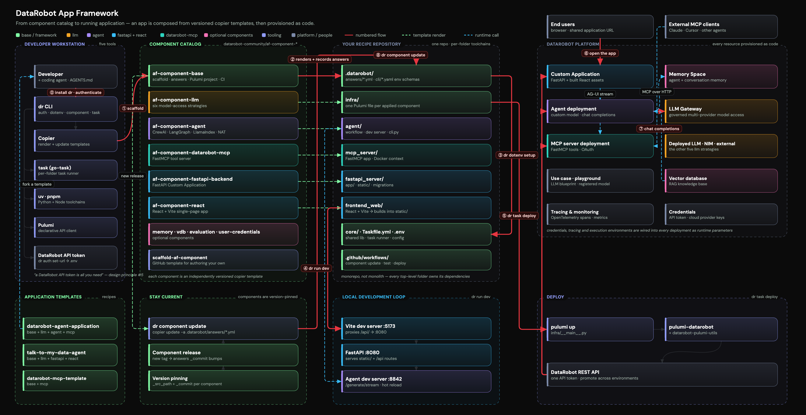

# Design

The App Framework is built around a clear set of architectural decisions. This section explains how it works, why it was designed this way, and what each layer does.

## Overview

App templates are code-first recipes for building full-stack DataRobot applications. Think Helm charts or full-stack starters like the [FastAPI full-stack template](https://github.com/fastapi/full-stack-fastapi-template), but with DataRobot AI blueprints baked in and everything wired together for production.

The goal is to let teams take a working AI solution pattern, deploy it on DataRobot, and keep it customizable enough for real application development.

Foundation application templates are the reference implementations built from this framework:

| Template | Description |
|----------|-------------|
| [Talk to My Docs](https://github.com/datarobot-community/talk-to-my-docs-agents) | Guarded RAG Assistant. |
| [Talk to My Data](https://github.com/datarobot-community/talk-to-my-data-agent) | Data Analyst. |
| [DataRobot Agent Application](https://github.com/datarobot-community/datarobot-agent-application) | Multi-agent orchestration starter. |

Each foundation application template starts in a private repository and publishes to a corresponding open-source repository through GitHub release mechanics. In practice, most external developers interact with the open-source repositories and then create their own recipe repository from those examples or from the component system described in these docs.

**So, what is the App Framework?**

It is the software and templates that build application templates and make them easier to customize and extend. The App Framework succeeds when adding features, creating application templates from scratch, and upgrading existing application templates remains straightforward.

## In this section

- [**Principles**](principles.md) — The design decisions that guide every component.
- [**Component model**](component-model.md) — How templates are structured, applied, and updated.
- [**CLI**](cli.md) — The `dr` command and what it handles.
- [**Declarative API**](declarative-api.md) — Infrastructure-as-code for DataRobot resources.
- [**Documentation**](documentation.md) — How component docs and skills are organized, including writing style standards.
- [**UI library**](ui-library.md) — The shared dr-ui component registry for React frontends.
