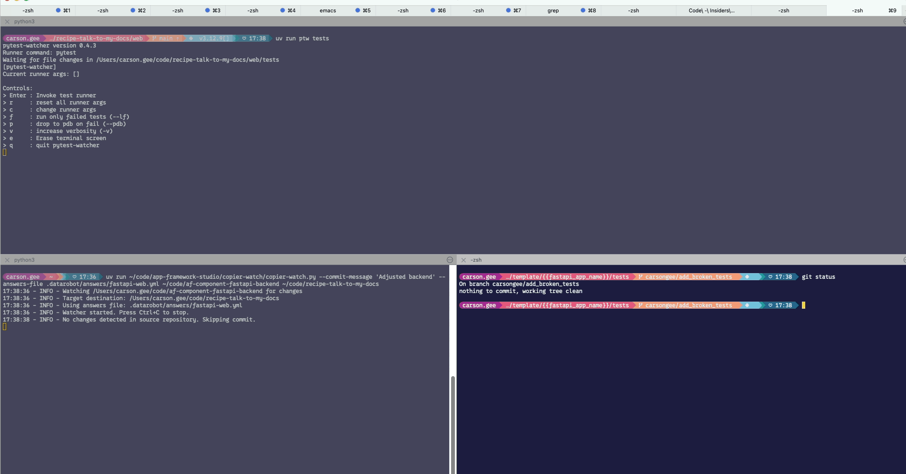

# Developer guide

## Prerequisites

- [uv](https://docs.astral.sh/uv/getting-started/installation/)
- [Task](https://taskfile.dev/installation/)

### Install Task

#### macOS

```bash
brew install go-task/tap/go-task
```

#### Linux

```bash
sh -c "$(curl --location https://taskfile.dev/install.sh)" -- -d -b /usr/local/bin
```

#### Windows

```powershell
choco install go-task
```

## Running the documentation site locally

```bash
task docs-serve
```

This will install dependencies and start a local server at [http://localhost:8000](http://localhost:8000). The site reloads automatically as you edit files in the `docs/` directory.

---

## Copier Watch

`tools/copier-watch/copier-watch.py` is a development tool for iterating rapidly on [copier](https://copier.readthedocs.io/en/stable/) templates — the component repos like `af-component-fastapi-backend`.

The script watches all file changes in a source template repo. When you edit a template, it:

1. Creates a local commit on the source repo (amending it on each subsequent change)
2. Runs `copier update` on the destination repo using that local commit

This lets you iterate with Jinja templates without pushing remote commits. For each change in the source, it also resets the destination repo to apply the full changeset from scratch — so you don't accumulate partial state.

!!! warning
    This script modifies git repositories and can cause data loss. Ensure the destination repo has a clean `git status` before use. It runs `git reset` and `git clean` on the destination.

### Usage

```bash
uv run tools/copier-watch/copier-watch.py \
  --commit-message 'Adjusted backend' \
  --answers-file .datarobot/answers/fastapi-web.yml \
  ~/code/af-component-fastapi-backend \
  ~/code/recipe-talk-to-my-docs
```

Arguments:

| Argument | Description |
|----------|-------------|
| `--commit-message` | Message for the local amend commit on the source repo |
| `--answers-file` | Path to the copier answers file in the destination repo |
| `<source>` | Path to the component template repo being edited |
| `<destination>` | Path to the recipe repo to apply changes to |

### Typical workflow

- Top shell: `pytest` watcher running in the destination repo
- Bottom left: `copier-watch` watching `af-component-fastapi-backend` for changes
- Bottom right: editing the template — when tests change, the updated template is applied to the destination repo and `pytest-watcher` picks them up automatically



---

## Component Doc Update

`tools/af_component_doc_update` generates a `README.generated.md` scaffold for App Framework component repos. It reads the component's `copier-module.yaml` — which declares the module name, description, dependencies, and whether the component is repeatable — and renders a structured README template with all the standard sections pre-filled and placeholder comments for the parts that need human authoring.

### Usage

From the `tools/af_component_doc_update` directory:

```bash
uv run af-component-doc-update ~/code/af-component-fastapi-backend
```

This writes `README.generated.md` into the target component repo. The output includes:

- Header with badges (version, license) and links
- Quick start (`dr component add` and `uvx copier copy` commands)
- Component dependencies table (required and collaborates-with), populated from `copier-module.yaml`
- Section scaffolding with inline authoring guidance for: prerequisites, local development, troubleshooting, next steps, and contributing

The `[[INSERT ... HERE]]` placeholders and comment blocks guide what to write in each section. Delete the comments once the section is filled in.
