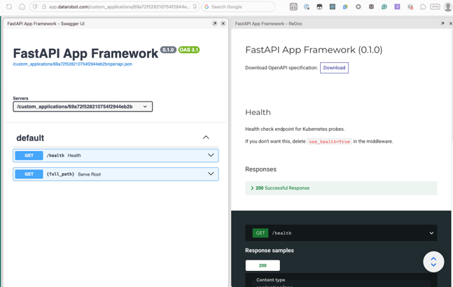
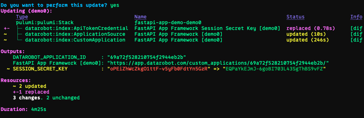
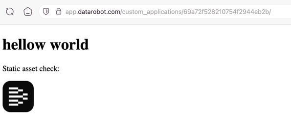
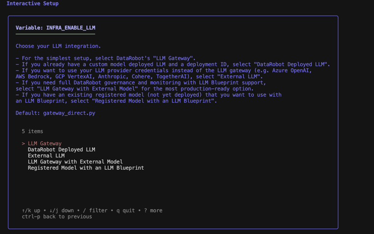
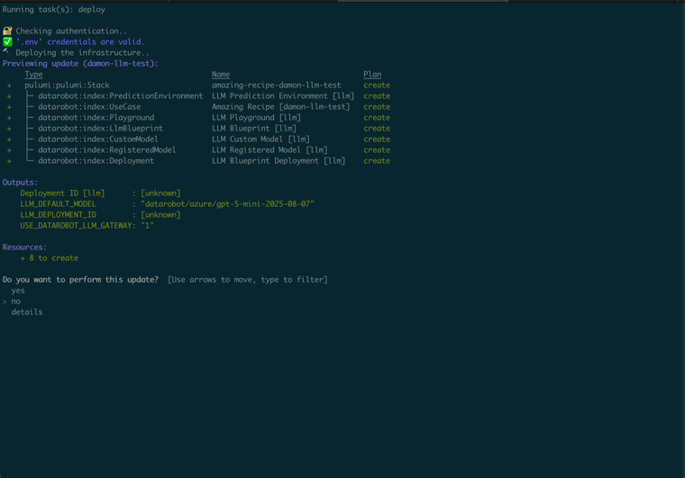
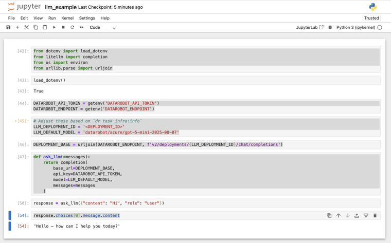
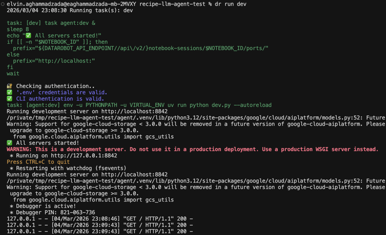
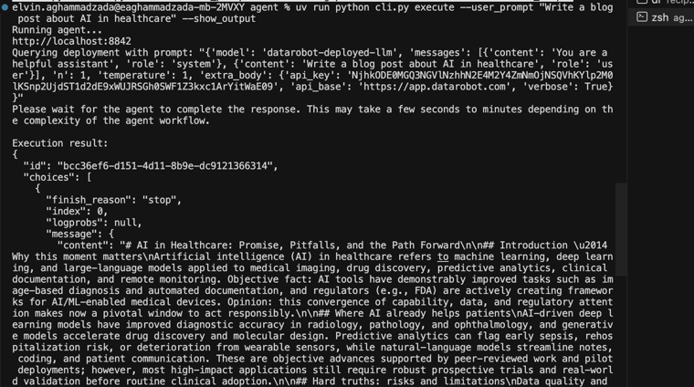
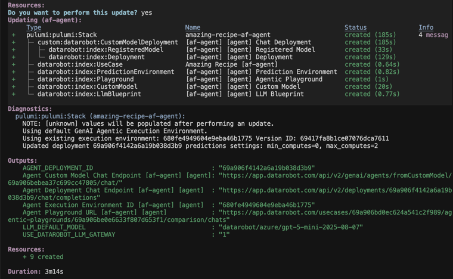

# 0-Vibe: Build your first application

This guide walks you through building an App Framework recipe from scratch, from an empty repository to a deployed DataRobot application. It covers three progressively richer examples: a simple FastAPI application, an LLM with a notebook, and a full agentic workflow.

## Prerequisites

- [uv](https://docs.astral.sh/uv/getting-started/installation/) installed
- [DataRobot CLI](https://cli.datarobot.com) installed
- A DataRobot account and API token

This guide assumes that you are creating a new recipe repository and applying App Framework components into it. A recipe is the repository that contains your application code, infrastructure, and component answers files.

## Creating a new application from scratch

Every App Framework recipe starts the same way, regardless of what you're building.

### Step 1: Create your repository

1. Head to the [datarobot-oss](https://github.com/datarobot-oss) GitHub org and create a new repository.
2. Name it with a `recipe-` prefix if you're making a reusable template.
3. Start from [`oss-template-repo`](https://github.com/datarobot-oss/oss-template-repo). It includes the standard project scaffolding.

**Important Git settings:**

- Allow merge commits.
- Set merge commits as the default merge strategy.

### Step 2: Clone and prepare

```bash
git clone git@github.com:datarobot-oss/recipe-your-app-name.git
cd recipe-your-app-name
```

### Step 3: Install uv

```bash
curl -LsSf https://astral.sh/uv/install.sh | sh
```

### Step 4: Bootstrap your recipe

Run the base component copier and answer the interactive questions:

```bash
uvx copier copy https://github.com/datarobot-community/af-component-base .
```

Copier prompts for your recipe name, the components you want, and other configuration. Answer thoughtfully because those choices shape the structure of your recipe. You now have the foundation in place, and everything from here is customization.

After this step, expect your repository to contain the shared project files that other components build on, including `.datarobot/`, a `Taskfile.yaml`, and Pulumi configuration.

---

## Example 1: Simple FastAPI application

### Overview

A two-component App Framework application that covers a wide range of common functionality: a FastAPI backend served as a DataRobot Custom Application, with a React frontend included.

### Key components

- [`af-component-fastapi-backend`](https://github.com/datarobot-community/af-component-fastapi-backend)
- [`af-component-react`](https://github.com/datarobot-community/af-component-react) (optional)

### Implementation

This example assumes that you already completed Steps 1 through 4 and that the `base` component is present in your repository.

After bootstrapping with `af-component-base`, add the FastAPI backend:

```bash
uvx copier copy https://github.com/datarobot-community/af-component-fastapi-backend .
```

Accept the defaults. Then compose the task definitions for the generated project:

```bash
dr task compose .
```

Configure your DataRobot credentials:

```bash
dr auth set-url
dr dotenv setup
```

### Develop locally

Start the development server:

```bash
dr run dev
```

Visit `http://localhost:8080`. Changes are auto-discovered and the server restarts on every file change.

The FastAPI autodocs are available at `/docs` and `/redoc`:



### Deploy to DataRobot

When you're happy locally, deploy:

```bash
dr run deploy
```

If your generated project exposes deployment commands through `dr task`, use the project-provided deployment command shown by `dr task --list`. In this guide, the examples use the command produced by the generated Taskfile for each scenario.

The CLI previews the resources to be created and asks for confirmation:



After deployment, your application is live at the URL shown in the output. Open it from your terminal with `cmd-click` or `ctrl-shift-click`:



With these steps, you get unit tests, linters, deployments, fast local iteration, and everything needed for team-driven development through GitHub Actions.

**Lifecycle commands:**

```bash
dr task infra:down   # Tear down to save costs.
dr run deploy        # Bring it back.
dr auth set-url      # Switch to a different DR environment.
```

---

## Example 2: LLM with notebook

### Notebook example overview

For fast iteration on LLM use cases that don't yet need a full agentic workflow, use the LLM component and iterate in a Python notebook — locally or in DataRobot.

### Notebook example components

- [`af-component-llm`](https://github.com/datarobot-community/af-component-llm)

### Notebook example implementation

Apply the LLM component to your recipe:

```bash
uvx copier copy git@github.com:datarobot-community/af-component-llm .
```

Accept the defaults, then set up your environment:

```bash
dr dotenv setup
```

The setup wizard asks for your LLM integration type. For most use cases, select **LLM Gateway with External Model** — this is the most production-ready option:



### Deploy the LLM

```bash
dr task deploy
```



Confirm and deploy. When complete, note the deployment ID because you need it for notebook development. You can retrieve it again at any time with:

```bash
dr task infra:info
```

You can test your LLM in the DataRobot workbench under your use case → LLM Playground.

### Notebook development

Create a notebooks directory and start Jupyter:

```bash
mkdir notebooks
cd notebooks
uv init .
uv add jupyter dotenv litellm
uv run jupyter notebook
```

!!! note "Codespaces"
    If running in GitHub Codespaces, skip the `uv` commands. Run `pip install dotenv litellm` and use the "Create Notebook" button instead.

Create a new notebook named `llm_example`. Add these cells:

```python
from dotenv import load_dotenv
from litellm import completion
from os import getenv
from urllib.parse import urljoin

load_dotenv()
```

```python
DATAROBOT_API_TOKEN = getenv('DATAROBOT_API_TOKEN')
DATAROBOT_ENDPOINT = getenv('DATAROBOT_ENDPOINT')
```

```python
# Adjust these based on `dr task infra:info`.
LLM_DEPLOYMENT_ID = 'DEPLOYMENT_ID'
LLM_DEFAULT_MODEL = 'datarobot/azure/gpt-5-mini-2025-08-07'
DEPLOYMENT_BASE = urljoin(DATAROBOT_ENDPOINT, f'v2/deployments/{LLM_DEPLOYMENT_ID}/chat/completions')
```

```python
def ask_llm(*messages):
    return completion(
        base_url=DEPLOYMENT_BASE,
        api_key=DATAROBOT_API_TOKEN,
        model=LLM_DEFAULT_MODEL,
        messages=messages
    )
```

```python
response = ask_llm({"content": "Hi", "role": "user"})
response.choices[0].message.content
```



### Deploy the notebook to DataRobot

Create `infra/infra/notebook.py`:

```python
from pathlib import Path
from pulumi_datarobot.notebook import Notebook

from . import use_case

PROJECT_ROOT = Path(__file__).resolve().parents[2].absolute()
NOTEBOOK_PATH = PROJECT_ROOT / "notebooks" / "llm_example.ipynb"

notebook = Notebook("llm_example_notebook",
    file_path=str(NOTEBOOK_PATH), use_case_id=use_case.id)
```

Then run `dr task deploy` again. The notebook appears in your use case in the DataRobot workbench.

!!! tip
    In the DataRobot-hosted notebook, install dependencies via the terminal: `pip install litellm dotenv`

---

## Example 3: LLM with agent

### Agent example overview

For use cases that need agents, tools, and multi-step workflows, the agent component provides a full agentic framework built on top of the LLM component from Example 2.

### Agent example components

- [`af-component-llm`](https://github.com/datarobot-community/af-component-llm)
- [`af-component-agent`](https://github.com/datarobot-community/af-component-agent)

### Agent example implementation

#### Step 1 — Apply the base component

```bash
uvx copier copy https://github.com/datarobot-community/af-component-base .
```

Accept the defaults.

#### Step 2 — Apply the LLM component

```bash
uvx copier copy https://github.com/datarobot-community/af-component-llm .
```

Accept the defaults.

#### Step 3 — Apply the agent component

Use the CLI:

```bash
dr component add agent
```

When prompted, choose your agent framework: **CrewAI**, **LangGraph**, **LlamaIndex**, or the YAML-based NeMo Agent Toolkit.

The component creates the following structure:

```text
agent/
├── agent/myagent.py   # Agent workflow
├── cli.py             # Command-line interface
├── dev.py             # Local development server
├── tests/             # Test suite
└── public/            # UI assets
infra/infra/agent.py   # Pulumi configuration
```

#### Step 4 — Configure your environment

```bash
dr dotenv setup
```

The wizard asks for:

1. Agent port (default: 8842).
2. DataRobot execution environment.
3. Execution environment version ID.
4. Pulumi passphrase.
5. DataRobot default use case (can leave blank).
6. LLM Gateway configuration.



### Develop and test locally

Start the server:

```bash
# Terminal 1
dr run dev
```

In another terminal, run the agent:

```bash
# Terminal 2
uv run python cli.py execute --user_prompt "Write a blog post about AI in healthcare" --show_output
```

### Deploy the agent

```bash
dr task deploy
```



The CLI asks you to name your stack, previews the resources (LLM deployment and agent deployment), and deploys both to DataRobot.

After deployment, find your agent in the DataRobot workbench under your use case. Interact with it through the agent playground or via API calls to the deployment endpoint:



### Customize the agent

Edit `agent/agent/myagent.py` to:

- Change agent roles and goals.
- Modify task descriptions.
- Add more agents to the crew.
- Integrate additional MCP tools.

## Discovering available components

- **GitHub search:** Search for `af-component` in the `datarobot` and `datarobot-community` GitHub organizations.
- **Ask in Slack:** The `#applications` channel in DataRobot's public Slack includes contributors who regularly share component examples and guidance.

## CI/CD setup

Once your recipe is running, set up CI/CD for automated testing and deployment:

- [DataRobot CI/CD docs](https://docs.datarobot.com/en/docs/api/reference/declarative-api.html).
- [`datarobot-agent-skills`](https://github.com/datarobot-oss/datarobot-agent-skills/)&mdash;CI/CD skill for GitLab and GitHub.
