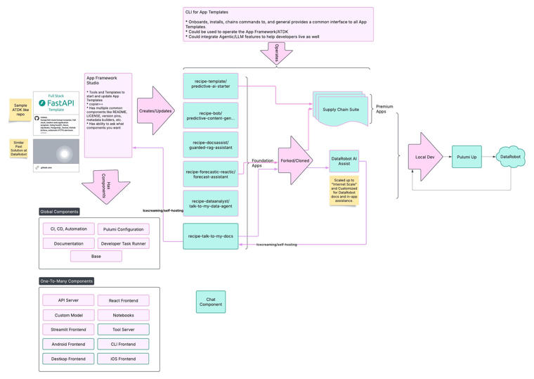

# DataRobot App Framework

The App Framework is the software and tooling that makes building, updating, and shipping DataRobot applications fast. It gives developers and data scientists a code-first starting point, similar to Helm charts or full-stack starters, but built specifically for DataRobot.

## What it is

App templates are code-first recipes that bundle everything needed to build and run a full-stack DataRobot application: infrastructure-as-code, a local development loop, CI/CD, and deployment to DataRobot Custom Applications, all from a single repo. Foundation templates already exist for:

- **[Talk to My Docs](https://github.com/datarobot-community/talk-to-my-docs-agents)**&mdash;Guarded RAG Assistant.
- **[Talk to My Data](https://github.com/datarobot-community/talk-to-my-data-agent)**&mdash;Data Analyst.
- **[DataRobot Agentic starter](https://github.com/datarobot-community/datarobot-agent-application)**&mdash;Multi-agent orchestration starter.
- **[DataRobot MCP](https://github.com/datarobot-community/af-component-datarobot-mcp)**&mdash;FastMCP server with DataRobot predictive tools and third-party integrations.

## How it works

The framework is built around three ideas:

**Components** are copier-style templates, each a top-level folder or file set, that you layer into your repo to add capabilities. You apply them one at a time and answer a few questions. Your answers are recorded in `.datarobot/`, so the stack can be updated automatically later.

| Component | What it adds |
|-----------|-------------|
| [**base**](components/base.md) | Task runner, Pulumi project, CI/CD scaffolding, `.datarobot/` config. |
| [**fastapi-backend**](components/fastapi-backend.md) | FastAPI server, local dev loop, Custom App deployment. |
| [**react**](components/react.md) | React + Vite frontend with dev proxy and static asset build. |
| [**llm**](components/llm.md) | LLM Gateway or external model integration. |
| [**agent**](components/agent.md) | CrewAI, LangGraph, LlamaIndex, or NeMo agent workflow. |
| [**datarobot-mcp**](components/datarobot-mcp.md) | FastMCP server with DataRobot predictive tools and third-party integrations. |

**The DataRobot CLI** (`dr`) is your primary interface. It handles authentication, environment setup, local development, and deployment, so you never have to manually edit YAML files or track down the right command.

**The Declarative API** (via Pulumi) manages your DataRobot resources, including use cases, deployments, playgrounds, and custom apps, as infrastructure-as-code. This makes your stack reproducible across environments.

## Get started

- [**Design**](design/index.md)&mdash;Understand the architecture, principles, and building blocks.
- [**0-Vibe: Build your first app**](guides/zero-vibe.md)&mdash;Go from empty repo to deployed app in minutes.
- [**Adding custom pages**](guides/custom-pages.md)&mdash;Extend FastAPI templates with new routes and templates.
- [**Adding a vector database**](guides/vector-database.md)&mdash;Ground your agent in real documents.
- [**Developer guide**](developer.md)&mdash;Run the docs site locally and contribute.
- [**Skills**](skills.md)&mdash;AI agent skills for your coding assistant.
